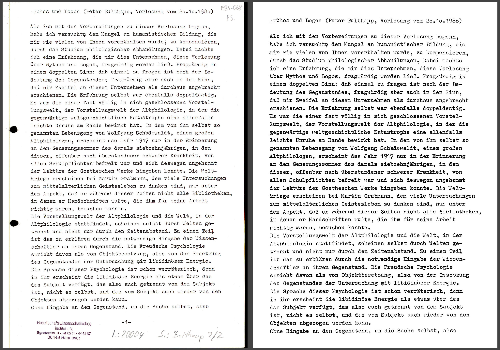

# Aufbereitung der Vorlagen mit ScanTailor

## Vor der Zeichenerkennung

Die Digitalisate der verschriftlichten Vorlesung _Mythos und Logos I_ sind farbige TIFF-Dateien. Die Vorlagen waren teils mehrfach kopierte Schreibmaschinenseiten, die von verschiedenen Schreibern mit verschiedenen Maschinen nach Audiomittschnitten erstellt wurden. Die Qualität und das Schriftbild unterscheiden sich daher teils stark je nach Vorlesungstermin.

Die Seiten wurden mit 300 DPI gescannt, womit sie an der unteren Grenze dessen liegen, was man für eine Weiterverarbeitung per OCR (Optical Character Recognition) empfehlen würde.

Die im nachfolgenden Schritt eingesetzte OCR-Software _Tesseract_ bringt von sich aus Mechanismen zur Verbesserung der Vorlagenqualität mit. Insbesondere werden die Bilder vor der Erkennung reine Schwarz-Weiß-Bilder umgewandelt – es gibt also nur schwarze oder weiße Pixel. Dabei soll eine klare Trennung zwischen Hintergrund – dem Papier – und Vordergrund – den Buchstaben – erreicht werden.

Manuelle Eingriffe sind bei dieser Automatik kaum möglich und sie kann zentrale Probleme der Vorlagen, wie z.B. stark winklig kopierte Seiten, nicht lösen. Da auf den Rändern der Vorlagen teils auch Randnotizen, Stempel und vor allem Lochungen vorhanden sind, die die Texterkennung stark irritieren können, ist eine vorherige Aufbereitung der Vorlagen unverzichtbar.

Die dafür eingesetzte Open Source Software _ScanTailor Advanced_ bietet dafür einen stark automatiserten Ablauf, der zugleich an jeder Stelle im Bedarfsfall manuell beeinflusst werden kann. Mit _ScanTailor_ werden die farbigen Vorlagen in monochrome Bilder transformiert, die Ränder beschnitten, schiefe Zeilen gerade ausgerichtet und mögliche Irritationen entfernt. Die so erstellten Vorlagen führen je nach Vorlage zu einer spürbar verbesserten Erkennungsrate. 

__Beispiel: VNS-005_004__

Die gescannte Seite vor und nach der Aufbereitung mit _ScanTailor_.

## Notizen zu den Einstellungen in _ScanTailor_

### Bearbeitungseinheit

Zwar sind die Vorlagen insgesamt heterogen, innerhalb eines Vorlesungstermins jedoch insofern homogen, als dass die Seiten von der selben Schreibmaschine stammen und einheitliche idiosynkratische Vorstellungen bezüglich der Interpunktion aufweisen. Einige Vorlesungen haben offenbar mehrere Kopierzyklen durchlaufen.

Durch die Festlegung auf je einen Vorlesungstermin als zu bearbeitende Einheit können die Einstellungen für die Aufbereitung recht einheitlich auf qualitativ vergleichbare Vorlagen angewandt werden.

Entsprechend der Inhaltstabelle wird für jeden Vorlesungstermin ein zweistellig nummeriertes Verzeichnis angelegt. Darin befinden sich sukzessive die zur Bearbeitung gehörenden Dateien:

* *.ScanTailor – Projektdatei von ScanTailor mit den relevanten Einstellungen (nicht im Git-Repo)
* Output von Scantailor – monochrome TIFF-Bilder (nicht im Git-Repo)
* nach der OCR: generierte Textdateien (diese sind im Git-Repo)

Im folgenden Hinweise zu den Einstellungen, die in ScanTailor vorgenommen werden.

### Import

Die Vorlagen liegen außerhalb der Repo-Hierarchie. Es handelt sich dabei um die umkomprimierten Farb-Tiffs aus dem Archiv-Master. Die relevanten Seiten werden am Anfang zu dem ScanTailor-Projekt hinzugefügt.

Es besteht kein Bedarf zur Korrektur der DPI-Werte aus den Metadaten. Als _Ooutput_ wird der zugehörige Unterordner in der Repo-Hierarchie ausgewählt.

### Fix Orientation

Die Scans sind in der Regel korrekt ausgerichtet. Sollten einzelne Seiten auf dem Kopf stehen, so lässt sich das hier korrigieren.

### Split Pages

Diese Funktion dient der Trennung von linken und rechten Buchseiten, wenn beide gemeinsam gescannt wurden – sie ist hier also irrelevant. Manuell ist "einseitig" auszuwählen. Dies wird dann auf Seiten angewendet.

### Deskew

_ScanTailor_ versucht schräge Seiten automatisch so auszurichten, dass die Grundlinien horizontal sind. Dies klappt nicht bei jeder Vorlage gleich gut. Schräge Zeilen verschlechtern die OCR-Ergebnisse maßgeblich, daher muss hier in Einzelfällen manuell korrigiert werden.

### Select Content

Die automatische Erkennung der Seitenbereiche mit Textinhalt muss in der Regel manuell korrigiert werden. Das Ziel ist die Begrenzung auf den Textkörper – dazu gehört auch die Entscheidung, die getippten Seitenzahlen nicht mit zu erfassen. Die Reihenfolge ist durch die Dateinamen gesetzt, daher werden sie nicht benötigt.

Ebenfalls außen vor sind handschriftliche Ergänzungen oder Zeichnungen. Sofern sie relevant sind, müssen sie bei der Korrektur der OCR-Texte vermerkt werden.

### Margins

Nichts spricht gegen die Standardeinstellungen für Ränder. Die Ränder werden nach dem zuvor ausgewählten Content hinzugefügt.

Entscheidend für das Erscheinungsbild ist die Ausrichtung. Die jeweils letzte Seite kann bündig zur oberen Kante ausgerichtet werden, um nicht zentriert zu erscheinen. Für die OCR hat dies keine Auswirkungen.

### Output

Wir generieren monochrome Bilder mit einer __Auflösung von 400 DPI__. Die gewählte Auflösung macht Unterschiede bei der Zeichenerkennung.

Experimentell ließ sich zwischen 400 und 600 DPI jedoch kein Grund für die höhere Auflösung finden. Zwar sind die Ergebnisse verschieden, nicht aber besser oder schlechter. Manche Fehler verschwinden, andere kommen hinzu.

Der __Threshold-Wert__ wird auf maximal eingestellt. Ausgewählt ist der Otsu-Algorithmus. Dies führt zu "fetten" Buchstaben, die besser erkannt werden. Je nach Vorlage kann ein moderateres Vorgehen erforderlich sein.

__Despeckling__ entfernt kleine Punkte, die ansonsten leicht als Zeichen fehlinterpretiert werden könnten. Auch hier ist der Maximalwert eine gute Wahl.

Die allgemeinen Einstellungen zum Output müssen für alle Seiten übernommen werden. Spezifisch für die jeweilige Seite sind indessen die Fill Zones.

Die gröberen Irritationen müssen manuell als __Fill Zones__ markiert und damit gelöscht werden. Das bezieht sich auf Verunreinigungen, die nicht vom Despeckling erfasst wurden, "schwarze" Lochungen, Bleistiftnotizen, Zeichnungen und alles, was nicht zum getippten Textblock gehört. Handschriftliche griechische Termini können als Platzhalter beibehalten werden. Sie bedürfen der späteren manuellen Ersetzung durch Unicode-Zeichen.

´